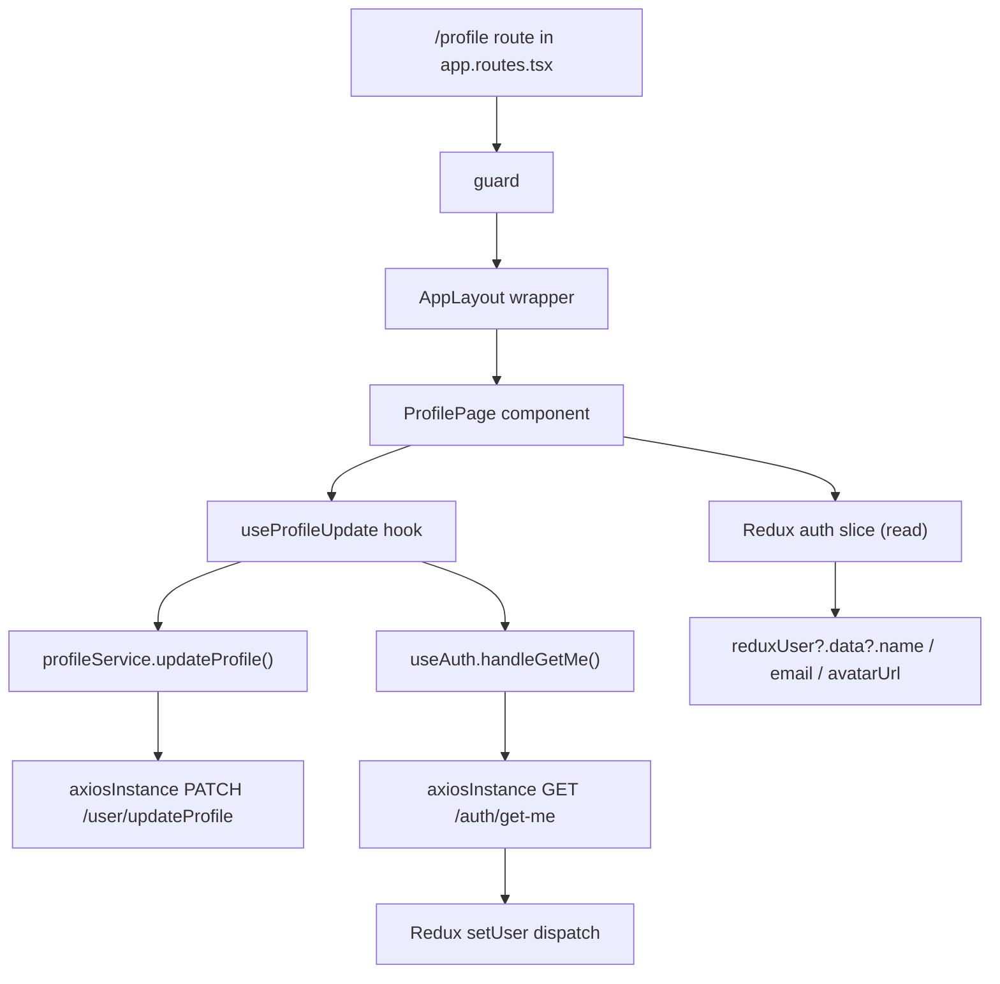
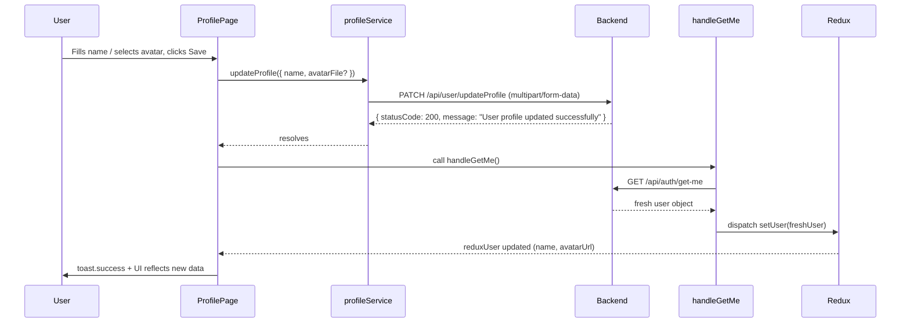

# Design Document: User Profile Page

## Overview

A dedicated `/profile` route for authenticated learners that displays their current profile information (name, email, avatar) and provides an inline edit form to update their name and avatar. On successful save the page calls `PATCH /api/user/updateProfile` with `multipart/form-data`, then refetches fresh user data via the existing `handleGetMe` hook and updates the Redux auth slice, so every component that reads from the store immediately reflects the changes.

The page lives inside the existing `AppLayout` wrapper (which renders the top `<Navbar minimal />`), is protected by the `<Protected>` guard (learner-only), and follows the feature-folder structure already used across the project (`src/features/user-profile/{ pages/, service/, hook/ }`). The `UserDashboard` sidebar gains a new "Profile" navigation link pointing to `/profile`.

---

## Architecture



---

## Sequence Diagrams

### Profile Update Flow



### Avatar Preview Flow

```mermaid
sequenceDiagram
    participant User
    participant ProfilePage

    User->>ProfilePage: Clicks avatar area / "Change photo" button
    ProfilePage->>ProfilePage: Opens hidden <input type="file" accept="image/*">
    User->>ProfilePage: Selects image file
    ProfilePage->>ProfilePage: Creates object URL via URL.createObjectURL()
    ProfilePage->>User: Shows preview in avatar circle immediately
    Note over ProfilePage: Actual upload only on form submit
```



---

## Components and Interfaces

### ProfilePage

**Purpose**: Top-level page component rendered at `/profile`.

**Responsibilities**:
- Read current user from Redux (`useSelector`)
- Manage edit mode state (view vs. inline-edit)
- Render profile display section and edit form
- Delegate update logic to `useProfileUpdate` hook
- Show loading / error states via `react-hot-toast`

**Interface** (props: none — self-contained page):
```typescript
// src/features/user-profile/pages/ProfilePage.tsx
export default function ProfilePage(): React.ReactNode
```

**Key internal state**:
```typescript
const [isEditing, setIsEditing] = useState(false);
const [avatarPreview, setAvatarPreview] = useState<string | null>(null);
```

---

### useProfileUpdate Hook

**Purpose**: Wraps the service call + post-update `handleGetMe` refetch.

**Location**: `src/features/user-profile/hook/profile.hook.ts`

```typescript
interface UpdateProfilePayload {
  name: string;
  avatar?: File;
}

interface UseProfileUpdateReturn {
  updateProfile: (payload: UpdateProfilePayload) => Promise<void>;
  isLoading: boolean;
  error: string | null;
}

export const useProfileUpdate = (): UseProfileUpdateReturn
```

**Responsibilities**:
- Calls `profileService.updateProfile(payload)`
- On success: calls `handleGetMe()` from `useAuth` to refetch and update Redux
- Manages `isLoading` and `error` state internally
- Throws / surfaces errors for the page to display via toast

---

### profileService

**Purpose**: Service layer — plain async function calling `axiosInstance`.

**Location**: `src/features/user-profile/service/profile.service.ts`

```typescript
export const updateProfile = async (payload: {
  name: string;
  avatar?: File;
}): Promise<void>
```

**Implementation details**:
- Builds a `FormData` object, always appends `name`
- Appends `avatar` only when a `File` is provided
- Calls `axiosInstance.patch('/user/updateProfile', formData, { headers: { 'Content-Type': 'multipart/form-data' } })`
- Returns `void` (no data payload expected from the backend)

---

### Sidebar Update (UserDashboard)

**Purpose**: Add a "Profile" nav item to `SidebarContent` in `UserDashboard.tsx`.

**Change**: Add a `ProfileIcon` SVG and a `SidebarButton` that navigates to `/profile` using `useNavigate`.

---

## Data Models

### Redux User Shape (existing — read only)

```typescript
// Accessed as: reduxUser?.data?.name, reduxUser?.data?.email, reduxUser?.data?.avatarUrl
interface ReduxUser {
  data?: {
    name: string;
    email: string;
    avatarUrl?: string;
    role?: string;
  };
}
```

### UpdateProfilePayload

```typescript
interface UpdateProfilePayload {
  name: string;      // required; non-empty string
  avatar?: File;     // optional; must be an image file when provided
}
```

**Validation rules**:
- `name` must not be empty or whitespace-only
- `avatar`, when provided, must have a MIME type starting with `image/`
- File size for avatar should not exceed a reasonable limit (e.g., 5 MB) — enforced client-side

### Backend Response

```typescript
// PATCH /api/user/updateProfile
interface UpdateProfileResponse {
  statusCode: 200;
  message: "User profile updated successfully";
  // no data payload
}
```

---

## Algorithmic Pseudocode

### handleSubmit Algorithm

```pascal
PROCEDURE handleSubmit(formData)
  INPUT: formData { name: string, avatarFile?: File }
  OUTPUT: void (side effects: Redux update, toast notification)

  PRECONDITIONS:
    - name is non-empty after trim
    - avatarFile is undefined OR a valid image File object
    - user is authenticated (axiosInstance carries auth cookie)

  BEGIN
    SET isLoading ← true
    SET error ← null

    TRY
      CALL profileService.updateProfile({ name: formData.name.trim(), avatar: formData.avatarFile })
      CALL handleGetMe()         // refetches /auth/get-me → dispatches setUser
      CALL toast.success("Profile updated successfully")
      SET isEditing ← false
      SET avatarPreview ← null   // clear local preview; Redux now has authoritative URL
    CATCH error
      SET error ← error.message
      CALL toast.error(error.message OR "Failed to update profile")
    FINALLY
      SET isLoading ← false
  END
END PROCEDURE
```

**Postconditions**:
- On success: Redux `state.auth.user` contains fresh user data; `isEditing` is `false`
- On failure: Error is surfaced via toast; form remains open so user can retry

---

### Avatar Preview Algorithm

```pascal
PROCEDURE handleAvatarChange(fileInputEvent)
  INPUT: fileInputEvent (DOM change event from <input type="file">)
  OUTPUT: void (side effect: avatarPreview state updated)

  BEGIN
    file ← fileInputEvent.target.files[0]

    IF file IS undefined OR null THEN
      RETURN
    END IF

    IF file.type DOES NOT start with "image/" THEN
      CALL toast.error("Please select an image file")
      RETURN
    END IF

    IF file.size > 5 * 1024 * 1024 THEN
      CALL toast.error("Image must be smaller than 5 MB")
      RETURN
    END IF

    previewUrl ← URL.createObjectURL(file)
    SET avatarPreview ← previewUrl
    SET avatarFile ← file    // stored in react-hook-form or component state
  END
END PROCEDURE
```

---

## Key Functions with Formal Specifications

### profileService.updateProfile()

```typescript
export const updateProfile = async (payload: { name: string; avatar?: File }): Promise<void>
```

**Preconditions**:
- `payload.name` is a non-empty string (after trim)
- `payload.avatar` is `undefined` or a valid `File` with `type.startsWith('image/')`
- `axiosInstance` is configured with valid auth credentials

**Postconditions**:
- HTTP `PATCH /api/user/updateProfile` was sent with correct `multipart/form-data` body
- If response `statusCode === 200`, resolves with `void`
- If response is non-2xx, rejects with an `Error` containing the backend message

**Loop invariants**: N/A (no loops)

---

### useProfileUpdate.updateProfile()

```typescript
const updateProfile = async (payload: UpdateProfilePayload): Promise<void>
```

**Preconditions**:
- `payload.name` is non-empty
- Component using this hook is mounted

**Postconditions**:
- `isLoading` is `false` after promise settles
- On success: `handleGetMe()` has been called and Redux is updated
- On failure: `error` state contains the error message

---

## Example Usage

```typescript
// ProfilePage.tsx — consuming the hook
const { updateProfile, isLoading } = useProfileUpdate();

const onSubmit: SubmitHandler<ProfileFormValues> = async (values) => {
  await updateProfile({ name: values.name, avatar: avatarFileRef.current ?? undefined });
};

// react-hook-form wiring
const { register, handleSubmit, formState: { errors } } = useForm<ProfileFormValues>({
  defaultValues: { name: reduxUser?.data?.name ?? "" },
});

// Avatar file input handler
const handleAvatarChange = (e: React.ChangeEvent<HTMLInputElement>) => {
  const file = e.target.files?.[0];
  if (!file) return;
  if (!file.type.startsWith("image/")) { toast.error("Please select an image file"); return; }
  if (file.size > 5 * 1024 * 1024) { toast.error("Image must be smaller than 5 MB"); return; }
  setAvatarPreview(URL.createObjectURL(file));
  avatarFileRef.current = file;
};
```

---

## Correctness Properties

*A property is a characteristic or behavior that should hold true across all valid executions of a system — essentially, a formal statement about what the system should do. Properties serve as the bridge between human-readable specifications and machine-verifiable correctness guarantees.*

### Property 1: Name validation rejects whitespace-only input

*For any* string composed entirely of whitespace characters, submitting it as the `name` field must be rejected by the form before any network call is made, and the profile must remain unchanged.

**Validates: Requirements TBD**

### Property 2: Avatar preview is shown immediately on file selection

*For any* valid image `File` selected by the user, `avatarPreview` must be set to a non-null object URL immediately (before form submission), and the displayed avatar must update to that preview URL.

**Validates: Requirements TBD**

### Property 3: Successful update triggers Redux refresh

*For any* successful call to `profileService.updateProfile`, `handleGetMe` must be called exactly once afterward, resulting in `state.auth.user` being updated with fresh data from the server.

**Validates: Requirements TBD**

### Property 4: Invalid file type is rejected before upload

*For any* file whose MIME type does not start with `image/`, selecting it must not set `avatarPreview`, must not store it for upload, and must show an error toast.

**Validates: Requirements TBD**

### Property 5: Form data integrity — multipart body matches inputs

*For any* valid `UpdateProfilePayload { name, avatar? }`, the `FormData` object constructed by `profileService.updateProfile` must contain exactly `name` appended as a string field and `avatar` appended as a `File` field if and only if `avatar` is defined.

**Validates: Requirements TBD**

---

## Error Handling

### Scenario 1: Network / server error on PATCH

**Condition**: `axiosInstance.patch` rejects (network failure, 4xx, 5xx)
**Response**: `useProfileUpdate` catches the error, sets `error` state, calls `toast.error` with a user-friendly message
**Recovery**: Form stays open; user can retry without losing their inputs

### Scenario 2: `handleGetMe` fails after successful PATCH

**Condition**: `PATCH` succeeds but subsequent `GET /auth/get-me` fails
**Response**: UI shows stale data from Redux; a warning toast informs the user to refresh
**Recovery**: User can manually refresh; next app load will call `handleGetMe` (via existing app bootstrap)

### Scenario 3: Invalid avatar file type

**Condition**: User selects a non-image file
**Response**: Client-side validation rejects it immediately with `toast.error`; no network call made
**Recovery**: File input is reset; user can select a different file

### Scenario 4: Avatar file too large (>5 MB)

**Condition**: User selects an image larger than 5 MB
**Response**: Client-side validation rejects it immediately with `toast.error`
**Recovery**: File input is reset; user can select a smaller file

### Scenario 5: Unauthenticated access

**Condition**: User visits `/profile` without a valid session
**Response**: `<Protected>` guard redirects to `/login` before the page renders
**Recovery**: User logs in and is redirected back

---

## Testing Strategy

### Unit Testing Approach

- Test `profileService.updateProfile` with a mocked `axiosInstance` to verify `FormData` contents for cases: name only, name + avatar file
- Test `useProfileUpdate` hook with mocked service and mocked `handleGetMe`; verify `isLoading` transitions, error states, and that `handleGetMe` is called on success
- Test form validation logic: whitespace-only name rejection, invalid file type rejection, file size rejection

### Property-Based Testing Approach

**Property Test Library**: `fast-check` (already used in the JS/TS ecosystem)

- **Property 1** (whitespace names): Generate arbitrary whitespace-only strings; assert form validation rejects them without a network call
- **Property 2** (avatar preview): Generate mock `File` objects with `image/*` MIME types; assert `avatarPreview` is set to a non-null string
- **Property 3** (Redux refresh): For any successful service mock, assert `handleGetMe` is called exactly once
- **Property 4** (invalid file type): Generate mock files with non-image MIME types; assert they are rejected and no preview is set
- **Property 5** (FormData integrity): For any `{ name, avatar? }` payload, construct `FormData` and assert field presence matches payload

### Integration Testing Approach

- Test the full route render: `/profile` redirects to login when unauthenticated; renders `ProfilePage` when authenticated (using a mocked Redux store)
- Verify the sidebar in `UserDashboard` renders a "Profile" link and navigating to it lands on the profile page

---

## Performance Considerations

- Avatar previews use `URL.createObjectURL()` which is synchronous and memory-efficient; revoke with `URL.revokeObjectURL()` in `useEffect` cleanup to avoid memory leaks
- The profile page does not fetch additional data on mount beyond what's already in Redux; network activity is only triggered on form submit

---

## Security Considerations

- Avatar upload is validated on both client (MIME type, size) and backend (multer middleware, ImageKit upload)
- The `axiosInstance` sends credentials with every request; the backend `authenticateToken` middleware ensures only the authenticated user can update their own profile
- Name field is sanitized server-side; no XSS risk from rendering `reduxUser?.data?.name` in React (React escapes by default)

---

## Dependencies

- `react-hook-form` — form state management and validation
- `framer-motion` — entrance/exit animations consistent with existing pages
- `react-hot-toast` — success/error notifications
- `axiosInstance` (`src/lib/authInstance.ts`) — pre-configured HTTP client
- Redux Toolkit auth slice — `setUser`, `setLoading`, `setError` actions
- `useAuth` hook — `handleGetMe()` for post-update refetch
- Tailwind CSS v4 — styling consistent with dark theme
