# Video Transcoding Pipeline Documentation

> [!IMPORTANT]  
> This document details the entire video processing pipeline, from the client's initial upload request to the final HLS (HTTP Live Streaming) generation and database update.

## High-Level Architecture Overview

The VEO Learning Management System (VEOLMS) utilizes a distributed, asynchronous video transcoding pipeline to handle large video uploads and process them into an adaptive bitrate streaming format (HLS). This ensures that video playback is fast, scalable, and optimized for various network conditions.

The architecture relies on the following core components:
*   **Express REST API:** Handles authentication, presigned URL generation, and queue dispatching.
*   **Cloudflare R2 (S3-compatible object storage):** Provides two distinct buckets:
    *   `R2_RAW_BUCKET`: Temporary storage for raw user-uploaded videos (`.mp4`).
    *   `R2_HLS_BUCKET`: Permanent public storage for the transcoded HLS segmented videos (`.ts` and `.m3u8`).
*   **BullMQ & Redis:** A robust queue system used to asynchronously offload heavy processing (FFmpeg) to a separate worker process.
*   **Node.js Worker & FFmpeg:** A dedicated process responsible for downloading raw videos, converting them into multiple resolutions, segmenting them for HLS, and uploading the finalized files to R2.

---

## 1. Sequence & Data Flow

The following Mermaid diagram maps out the step-by-step sequence of operations across the Client, Backend API, Cloudflare R2, and the Background Worker.

```mermaid
sequenceDiagram
    autonumber
    actor Client as Frontend Client
    participant API as Backend API Server
    participant R2 as Cloudflare R2 Storage
    participant Queue as Redis / BullMQ
    participant Worker as Transcoding Worker
    participant DB as MongoDB

    %% Upload Flow
    rect rgb(30, 40, 50)
    Note over Client, DB: Phase 1: Secure Direct Upload
    Client->>API: GET /api/lesson/:lessonId/upload-url?fileName=video.mp4&fileType=video/mp4
    API-->>Client: 200 OK (signedUrl, rawKey)
    Client->>R2: PUT <signedUrl> (Upload raw video directly to raw bucket)
    R2-->>Client: 200 OK
    end

    %% Queue Dispatch
    rect rgb(30, 40, 50)
    Note over Client, DB: Phase 2: Trigger Processing
    Client->>API: POST /api/lesson/:lessonId/process { rawKey, fileName }
    API->>Queue: Enqueue Job (video-transcoding)
    API-->>Client: 200 OK (Job ID)
    end

    %% Worker Execution
    rect rgb(30, 40, 50)
    Note over Client, DB: Phase 3: Background Transcoding (Asynchronous)
    Queue-->>Worker: Dequeue Job
    Worker->>R2: Download raw video (Stream into /tmp)
    R2-->>Worker: video.mp4 stream
    
    Worker->>Worker: Execute FFmpeg (Scale to 360p, 480p, 720p, 1080p)
    Worker->>Worker: Generate .ts segments & resolution playlists
    Worker->>R2: Upload all HLS segments & playlists to HLS bucket
    R2-->>Worker: Upload Success
    
    Worker->>Worker: Generate master.m3u8 playlist
    Worker->>R2: Upload master.m3u8 to HLS bucket
    R2-->>Worker: Upload Success
    
    Worker->>DB: Update Lesson document (videoUrl = R2_PUBLIC_URL/master.m3u8)
    DB-->>Worker: Update Success
    Worker->>Worker: Clean up /tmp directory
    Worker->>Queue: Mark Job as Completed
    end
```



---

## 2. API Endpoint Specifications

### Step 1: Request an Upload URL
The client must securely request an upload URL. This ensures the server never has to buffer the initial heavy video upload.

*   **Endpoint:** `GET /api/lesson/:lessonId/upload-url`
*   **Query Parameters:**
    *   `fileName` (string): The name of the file being uploaded (e.g., `intro.mp4`).
    *   `fileType` (string): The MIME type of the file (e.g., `video/mp4`).
*   **Access Control:** Requires a valid authentication token and Admin privileges (`isAdmin`).
*   **Behavior:** 
    1. Generates a unique `rawKey` mapping to the `R2_RAW_BUCKET`.
    2. Utilizes `@aws-sdk/s3-request-presigner` to create a `signedUrl` valid for 1 hour.
*   **Response:**
    ```json
    {
      "success": true,
      "statusCode": 200,
      "message": "Upload URL ready",
      "data": {
        "signedUrl": "https://<cloudflare-r2-endpoint>/raw/123/1782...-intro.mp4?X-Amz-Signature=...",
        "rawKey": "raw/123/1782...-intro.mp4"
      }
    }
    ```

### Step 2: Trigger Processing
Once the client successfully PUTs the video file to the `signedUrl` and receives a 200 OK from R2, it must notify the backend.

*   **Endpoint:** `POST /api/lesson/:lessonId/process`
*   **Body:**
    ```json
    {
      "rawKey": "raw/123/1782...-intro.mp4",
      "fileName": "intro.mp4"
    }
    ```
*   **Access Control:** Requires a valid authentication token and Admin privileges (`isAdmin`).
*   **Behavior:** 
    1. Queues a new job onto the `video-transcoding` BullMQ queue.
    2. Responds immediately with the Job ID.

---

## 3. Worker Process Deep Dive

The background worker operates entirely independently from the main Express API instance, ensuring CPU-intensive FFmpeg tasks do not block the event loop or affect API latency. 

> [!TIP]  
> The worker leverages `concurrency: 1` per instance to prevent running out of memory/CPU, as FFmpeg is extremely resource-intensive. If scaling is needed, you can spawn additional worker containers horizontally.

### Processing Steps (`transcode.processor.ts`)

#### 1. File Ingestion
The worker receives the `rawKey` and streams the file from the `R2_RAW_BUCKET` directly to a newly created temporary directory (`/tmp/lesson-{id}-{timestamp}/input.mp4`).

#### 2. Resolution Transcoding (FFmpeg)
The video is then parsed and transcoded via `child_process.execSync` into four standard resolutions. 

| Name | Width x Height | Video Bitrate | Audio Bitrate |
| :--- | :--- | :--- | :--- |
| `360p` | 640 x 360 | 800 kbps | 96 kbps |
| `480p` | 854 x 480 | 1400 kbps | 128 kbps |
| `720p` | 1280 x 720 | 2800 kbps | 128 kbps |
| `1080p` | 1920 x 1080 | 5000 kbps | 192 kbps |

The FFmpeg parameters are optimized for HLS:
*   `-c:v libx264 -preset fast -crf 22`: Fast CPU encoding with constant rate factor 22 for excellent visual quality.
*   `-hls_time 6`: Divides the video into perfectly sized 6-second chunk `.ts` files.
*   `-hls_playlist_type vod`: Marks the playlist as Video-On-Demand (meaning the playlist is static and won't change).

#### 3. Segment & Playlist Upload
All resulting folders (e.g., `360p/`, `480p/`) containing `.ts` segments and their respective `index.m3u8` variant playlists are uploaded to the `R2_HLS_BUCKET`.

#### 4. Master Playlist Creation
The worker generates a `master.m3u8` file mapping out the bandwidths and resolutions, allowing adaptive streaming protocols in the browser (like `hls.js` or `video.js`) to seamlessly switch resolutions based on the user's internet speed. This is uploaded to `hls/{lessonId}/master.m3u8`.

#### 5. Database Commit & Cleanup
Finally, the MongoDB connection (established upon worker start) is utilized to execute a `findByIdAndUpdate` on the Lesson document, injecting the finalized, public `videoUrl`. The `finally` block ensures that the `/tmp/` directory is recursively destroyed whether the job succeeds or fails, preventing storage bloat.

---

## 4. Configuration & Environment

The following environment variables are critical for the pipeline to function correctly:

*   **R2_RAW_BUCKET**: Bucket designated for initial MP4 uploads.
*   **R2_HLS_BUCKET**: Publicly accessible bucket designated for the finalized HLS streams.
*   **R2_PUBLIC_URL**: The custom domain attached to the HLS bucket (e.g., `https://pub-XXXX.r2.dev`).
    > [!WARNING]  
    > Ensure that `R2_PUBLIC_URL` has **no trailing slash** or path segments, as it is directly appended to. (e.g. `https://pub-XXXX.r2.dev`, not `https://pub-XXXX.r2.dev/veolms`)
*   **R2_ACCESS_KEY / R2_SECRET_KEY**: API tokens configured in Cloudflare with `Object Read & Write` scope covering *both* buckets.

---

## 5. BullMQ Options & Resilience

The `videoQueue` is configured with robust failover and retention policies:

```typescript
defaultJobOptions: {
    attempts: 3,
    backoff: { type: "exponential", delay: 5000 },
    removeOnComplete: 50,  // Keep last 50 successful logs
    removeOnFail: 50,      // Keep last 50 failure logs
}
```
If an upload to R2 fails or FFmpeg crashes, the job is retried up to 3 times using exponential backoff (e.g., 5s, 25s, 125s) before marking the job as permanently failed.
