# VEO Learning Management System (LMS) - Backend API Documentation

Welcome to the backend repository of the **VEO Learning Management System**. This is a robust, production-ready RESTful API built to power an entire e-learning platform. It securely handles user authentication, course management, dynamic video processing pipelines, progress tracking, and student enrollments.

---

## 🚀 Tech Stack

- **Node.js & Express.js**: High-performance backend web framework.
- **TypeScript**: Strict static typing for maintainability and scalability.
- **MongoDB & Mongoose**: Flexible NoSQL database and elegant object data modeling.
- **Redis**: In-memory data structure store used for caching and as a BullMQ message broker.
- **BullMQ**: Production-grade queue system for managing and processing background jobs reliably.
- **Cloudflare R2**: S3-compatible object storage for storing raw video uploads and finalized HLS streams.
- **AWS SDK v3 (`@aws-sdk/client-s3`)**: Used to interact with Cloudflare R2's S3-compatible API — generating presigned upload URLs and uploading processed assets.
- **FFmpeg**: Industry-standard media processing tool used by the transcoding worker to convert raw video uploads into multi-resolution HLS adaptive bitrate streams.
- **ImageKit**: Optimized cloud storage and content delivery for course thumbnails and static assets.
- **Zod**: Type-safe schema validation for all incoming API payloads.

---

## 📁 Project Structure

The project strictly follows a domain-driven, modular architecture to separate concerns, making the codebase highly scalable and readable.

```
backend/
├── src/
│   ├── app.ts                  # Express application setup, middleware, and route mounting
│   ├── server.ts               # Application entry point and DB connection
│   ├── middlewares/            # Custom middlewares (auth, admin, error-handling, validation)
│   ├── utils/                  # Helper utilities (ApiError, ApiResponse, asyncHandler)
│   ├── infrastructure/         # External service integrations (ImageKit, etc.)
│   ├── worker/                 # BullMQ workers for background jobs (e.g., processing videos)
│   └── modules/                # Feature modules containing Models, Routes, and Controllers
│       ├── auth/               # User registration, login, token refresh, and Google OAuth
│       ├── user/               # User profiles and role management
│       ├── course/             # Course creation, modification, and content aggregation
│       ├── section/            # Course curriculum sections
│       ├── lesson/             # Individual lessons and video resources
│       ├── enrollments/        # Student enrollments to courses
│       └── progress/           # Tracking lesson completions and user progress
├── .env.example                # Sample environment variables configuration
├── package.json                # Project dependencies and scripts
└── tsconfig.json               # TypeScript compiler configuration
```

---

## 🔑 Key Features

- **Robust Authentication & Authorization**: Secure JWT-based authentication with access and refresh tokens. Role-based access control (RBAC) specifically separating standard users and Admins/Instructors.
- **Hierarchical Curriculum**: Data models cleanly structured into `Courses -> Sections -> Lessons`.
- **Advanced Aggregation Pipelines**: Leveraging MongoDB's `$lookup` and aggregation features to fetch fully-populated, deeply nested course structures efficiently.
- **Background Processing**: Utilizing BullMQ and Redis to offload heavy tasks (see the Transcoding Pipeline docs below).
- **Secure Video/Asset Delivery**: Integrated with ImageKit and AWS S3 for secure, optimized media distribution.
- **Strict Validation**: All API inputs are rigorously validated using Zod schemas to ensure absolute data integrity.
- **Progress Tracking**: Sophisticated user progress monitoring to track lesson completion and course milestones.

---

## 🛠 Setup & Installation

### 1. Prerequisites
Ensure you have the following installed on your machine:
- Node.js (v18 or higher)
- MongoDB (Running locally or a MongoDB Atlas URI)
- Redis Server (Running locally or via a cloud provider)
- FFmpeg (Required for the video transcoding worker)

### 2. Clone the Repository
```bash
git clone <repository-url>
cd backend
```

### 3. Install Dependencies
```bash
npm install
```

### 4. Configure Environment Variables
Create a `.env` file in the root directory based on the provided `.env.example`:

```env
PORT=3000
NODE_ENV=development
DB_URL=mongodb://localhost:27017/veolms
ACCESS_TOKEN_SECRET=your_access_token_secret
REFRESH_TOKEN_SECRET=your_refresh_token_secret
REDIS_URL=redis://localhost:6379
SALT_VALUE=10
MEETING_WINDOW_LIMIT=100
IMAGEKIT_PRIVATE_KEY=your_imagekit_private_key
IMAGEKIT_PUBLIC_KEY=your_imagekit_public_key
GOOGLE_CLIENT_ID=your_google_client_id
GOOGLE_CLIENT_SECRET=your_google_client_secret
GOOGLE_CALLBACK_URL=http://localhost:3000/api/auth/google/callback
CLIENT_URL=http://localhost:5173
```
*Note: Be sure to fill in your actual API keys for ImageKit and Google OAuth if you intend to test these features.*

### 5. Start the Development Server
```bash
# Starts the main API server with hot-reloading
npm run dev

# (Optional in a separate terminal) Starts the background worker
npm run worker:dev
```
The server should now be running on `http://localhost:3000`.

### 6. Building for Production
```bash
npm run build
npm run start
```

---

## 📡 API Module Overview

All endpoints are prefixed with `/api`.

- **`/api/auth`**: Endpoints for signing up, logging in, logging out, and refreshing tokens.
- **`/api/user`**: Manage current user profiles and fetch user information.
- **`/api/course`**: Endpoints to list courses, retrieve full course curriculums (using aggregation), and Admin-only endpoints for creating, updating, publishing, and deleting courses.
- **`/api/section`**: Admin-only endpoints for adding and managing curriculum sections within a course.
- **`/api/lesson`**: Admin-only endpoints for adding individual lessons to sections, managing video URLs, durations, and preview access.
- **`/api/enrollment`**: Endpoints for users to enroll in published courses, retrieve their enrollments, and Admin endpoints to view all enrollments across a specific course.
- **`/api/progress`**: Endpoints to track and mark specific lessons as completed, and to fetch progress across courses.

---

## 🛡 Error Handling

The application leverages a unified error-handling approach.
- `ApiError` utility throws structured HTTP exceptions.
- The global `errorHandler.ts` middleware traps all synchronous and asynchronous exceptions (managed seamlessly via `asyncHandler`), preventing crashes and consistently formatting the response payload:
```json
{
  "success": false,
  "message": "Error description",
  "errors": [],
  "stack": "..." // (Only in development)
}
```

---

## 🤝 Contribution Guidelines

1. **Typescript First**: Any new feature or module must have explicit interfaces or types (e.g., `feature.type.ts`).
2. **Controller/Service Separation**: Keep controllers as thin as possible. Delegate heavy business logic to dedicated services if complexity grows.
3. **Zod Validation**: Ensure every new request body/params structure is validated by a Zod schema in a `.validation.ts` file before it hits the controller. 
4. **Follow the Structure**: Create a dedicated directory inside `src/modules/` for any distinct new entity.

---

# Video Transcoding Pipeline Documentation

> [!IMPORTANT]  
> This document details the entire video processing pipeline, from the client's initial upload request to the final HLS (HTTP Live Streaming) generation and database update.

## High-Level Architecture Overview

The VEO Learning Management System (VEOLMS) utilizes a distributed, asynchronous video transcoding pipeline to handle large video uploads and process them into an adaptive bitrate streaming format (HLS). This ensures that video playback is fast, scalable, and optimized for various network conditions.

The architecture relies on the following core components:
*   **Express REST API:** Handles authentication, presigned URL generation, and queue dispatching.
*   **Cloudflare R2 (S3-compatible object storage):** Provides two distinct buckets:
    *   `R2_RAW_BUCKET`: Temporary storage for raw user-uploaded videos (`.mp4`).
    *   `R2_HLS_BUCKET`: Permanent public storage for the transcoded HLS segmented videos (`.ts` and `.m3u8`).
*   **BullMQ & Redis:** A robust queue system used to asynchronously offload heavy processing (FFmpeg) to a separate worker process.
*   **Node.js Worker & FFmpeg:** A dedicated process responsible for downloading raw videos, converting them into multiple resolutions, segmenting them for HLS, and uploading the finalized files to R2.

---

## 1. Sequence & Data Flow

The following Mermaid diagram maps out the step-by-step sequence of operations across the Client, Backend API, Cloudflare R2, and the Background Worker.

```mermaid
sequenceDiagram
    autonumber
    actor Client as Frontend Client
    participant API as Backend API Server
    participant R2 as Cloudflare R2 Storage
    participant Queue as Redis / BullMQ
    participant Worker as Transcoding Worker
    participant DB as MongoDB

    %% Upload Flow
    rect rgb(30, 40, 50)
    Note over Client, DB: Phase 1: Secure Direct Upload
    Client->>API: GET /api/lesson/:lessonId/upload-url?fileName=video.mp4&fileType=video/mp4
    API-->>Client: 200 OK (signedUrl, rawKey)
    Client->>R2: PUT <signedUrl> (Upload raw video directly to raw bucket)
    R2-->>Client: 200 OK
    end

    %% Queue Dispatch
    rect rgb(30, 40, 50)
    Note over Client, DB: Phase 2: Trigger Processing
    Client->>API: POST /api/lesson/:lessonId/process { rawKey, fileName }
    API->>Queue: Enqueue Job (video-transcoding)
    API-->>Client: 200 OK (Job ID)
    end

    %% Worker Execution
    rect rgb(30, 40, 50)
    Note over Client, DB: Phase 3: Background Transcoding (Asynchronous)
    Queue-->>Worker: Dequeue Job
    Worker->>R2: Download raw video (Stream into /tmp)
    R2-->>Worker: video.mp4 stream
    
    Worker->>Worker: Execute FFmpeg (Scale to 360p, 480p, 720p, 1080p)
    Worker->>Worker: Generate .ts segments & resolution playlists
    Worker->>R2: Upload all HLS segments & playlists to HLS bucket
    R2-->>Worker: Upload Success
    
    Worker->>Worker: Generate master.m3u8 playlist
    Worker->>R2: Upload master.m3u8 to HLS bucket
    R2-->>Worker: Upload Success
    
    Worker->>DB: Update Lesson document (videoUrl = R2_PUBLIC_URL/master.m3u8)
    DB-->>Worker: Update Success
    Worker->>Worker: Clean up /tmp directory
    Worker->>Queue: Mark Job as Completed
    end
```



---

## 2. API Endpoint Specifications

### Step 1: Request an Upload URL
The client must securely request an upload URL. This ensures the server never has to buffer the initial heavy video upload.

*   **Endpoint:** `GET /api/lesson/:lessonId/upload-url`
*   **Query Parameters:**
    *   `fileName` (string): The name of the file being uploaded (e.g., `intro.mp4`).
    *   `fileType` (string): The MIME type of the file (e.g., `video/mp4`).
*   **Access Control:** Requires a valid authentication token and Admin privileges (`isAdmin`).
*   **Behavior:** 
    1. Generates a unique `rawKey` mapping to the `R2_RAW_BUCKET`.
    2. Utilizes `@aws-sdk/s3-request-presigner` to create a `signedUrl` valid for 1 hour.
*   **Response:**
    ```json
    {
      "success": true,
      "statusCode": 200,
      "message": "Upload URL ready",
      "data": {
        "signedUrl": "https://<cloudflare-r2-endpoint>/raw/123/1782...-intro.mp4?X-Amz-Signature=...",
        "rawKey": "raw/123/1782...-intro.mp4"
      }
    }
    ```

### Step 2: Trigger Processing
Once the client successfully PUTs the video file to the `signedUrl` and receives a 200 OK from R2, it must notify the backend.

*   **Endpoint:** `POST /api/lesson/:lessonId/process`
*   **Body:**
    ```json
    {
      "rawKey": "raw/123/1782...-intro.mp4",
      "fileName": "intro.mp4"
    }
    ```
*   **Access Control:** Requires a valid authentication token and Admin privileges (`isAdmin`).
*   **Behavior:** 
    1. Queues a new job onto the `video-transcoding` BullMQ queue.
    2. Responds immediately with the Job ID.

---

## 3. Worker Process Deep Dive

The background worker operates entirely independently from the main Express API instance, ensuring CPU-intensive FFmpeg tasks do not block the event loop or affect API latency. 

> [!TIP]  
> The worker leverages `concurrency: 1` per instance to prevent running out of memory/CPU, as FFmpeg is extremely resource-intensive. If scaling is needed, you can spawn additional worker containers horizontally.

### Processing Steps (`transcode.processor.ts`)

#### 1. File Ingestion
The worker receives the `rawKey` and streams the file from the `R2_RAW_BUCKET` directly to a newly created temporary directory (`/tmp/lesson-{id}-{timestamp}/input.mp4`).

#### 2. Resolution Transcoding (FFmpeg)
The video is then parsed and transcoded via `child_process.spawn` into four standard resolutions.

### Why `spawn` over `exec`/`execSync`

When executing FFmpeg in a production environment, `spawn` is the **recommended choice** over `exec` or `execSync` for several critical reasons:

**1. Streaming Output (No Buffering)**
- `spawn` returns streams (`stdout`, `stderr`) that emit data as it becomes available
- `exec`/`execSync` buffers the entire output in memory, which can cause issues with long-running video processing
- FFmpeg can generate substantial log output during transcoding; `spawn` handles this efficiently

**2. Memory Efficiency**
- `spawn` does not buffer output, making it suitable for large video files
- `exec`/`execSync` stores entire output in memory, potentially causing `OutOfMemory` errors for large files
- With `spawn`, you can process videos of any size without memory concerns

**3. Real-time Progress Monitoring**
- `spawn` allows real-time parsing of FFmpeg progress updates from stderr
- You can extract percentage complete, current FPS, encoding speed in real-time
- Enables live progress reporting to clients or monitoring dashboards

**4. Non-blocking Execution**
- `spawn` is asynchronous and non-blocking by default
- `execSync` blocks the Node.js event loop, preventing concurrent request handling
- Even `exec` (async) buffers everything, while `spawn` streams data

**5. Better Error Handling**
- `spawn` emits `error` events for process-level issues
- You can capture both `stdout` and `stderr` separately
- Allows for better cleanup on process termination

**Example of how `spawn` is used in practice:**
```typescript
import { spawn } from 'child_process';

const ffmpeg = spawn('ffmpeg', [
  '-i', inputPath,
  '-c:v', 'libx264',
  '-preset', 'fast',
  '-crf', '22',
  '-hls_time', '6',
  '-hls_playlist_type', 'vod',
  outputSegmentPattern
]);

ffmpeg.stderr.on('data', (data) => {
  // Parse FFmpeg progress in real-time
  const output = data.toString();
  if (output.includes('time=')) {
    // Extract current encoding time and calculate percentage
    console.log('Transcoding in progress:', output.trim());
  }
});

ffmpeg.on('close', (code) => {
  if (code !== 0) {
    console.error(`FFmpeg process exited with code ${code}`);
  }
});
```

**When to use `exec`/`execSync`:**
- Short-running commands with predictable, small output
- When you need the complete output as a single string
- Simple shell commands where streaming isn't important

**When to use `spawn`:**
- Long-running processes like video/audio transcoding
- Commands that may produce large amounts of output
- When real-time progress monitoring is needed
- Production environments where memory efficiency matters

For the VEO LMS video transcoding pipeline, `spawn` ensures reliable, memory-efficient processing of videos of any size while providing visibility into the transcoding progress. 

| Name | Width x Height | Video Bitrate | Audio Bitrate |
| :--- | :--- | :--- | :--- |
| `360p` | 640 x 360 | 800 kbps | 96 kbps |
| `480p` | 854 x 480 | 1400 kbps | 128 kbps |
| `720p` | 1280 x 720 | 2800 kbps | 128 kbps |
| `1080p` | 1920 x 1080 | 5000 kbps | 192 kbps |

The FFmpeg parameters are optimized for HLS:
*   `-c:v libx264 -preset fast -crf 22`: Fast CPU encoding with constant rate factor 22 for excellent visual quality.
*   `-hls_time 6`: Divides the video into perfectly sized 6-second chunk `.ts` files.
*   `-hls_playlist_type vod`: Marks the playlist as Video-On-Demand (meaning the playlist is static and won't change).

#### 3. Segment & Playlist Upload
All resulting folders (e.g., `360p/`, `480p/`) containing `.ts` segments and their respective `index.m3u8` variant playlists are uploaded to the `R2_HLS_BUCKET`.

#### 4. Master Playlist Creation
The worker generates a `master.m3u8` file mapping out the bandwidths and resolutions, allowing adaptive streaming protocols in the browser (like `hls.js` or `video.js`) to seamlessly switch resolutions based on the user's internet speed. This is uploaded to `hls/{lessonId}/master.m3u8`.

#### 5. Database Commit & Cleanup
Finally, the MongoDB connection (established upon worker start) is utilized to execute a `findByIdAndUpdate` on the Lesson document, injecting the finalized, public `videoUrl`. The `finally` block ensures that the `/tmp/` directory is recursively destroyed whether the job succeeds or fails, preventing storage bloat.

---

## 4. Configuration & Environment

The following environment variables are critical for the pipeline to function correctly:

*   **R2_RAW_BUCKET**: Bucket designated for initial MP4 uploads.
*   **R2_HLS_BUCKET**: Publicly accessible bucket designated for the finalized HLS streams.
*   **R2_PUBLIC_URL**: The custom domain attached to the HLS bucket (e.g., `https://pub-XXXX.r2.dev`).
    > [!WARNING]  
    > Ensure that `R2_PUBLIC_URL` has **no trailing slash** or path segments, as it is directly appended to. (e.g. `https://pub-XXXX.r2.dev`, not `https://pub-XXXX.r2.dev/veolms`)
*   **R2_ACCESS_KEY / R2_SECRET_KEY**: API tokens configured in Cloudflare with `Object Read & Write` scope covering *both* buckets.

---

## 5. BullMQ Options & Resilience

The `videoQueue` is configured with robust failover and retention policies:

```typescript
defaultJobOptions: {
    attempts: 3,
    backoff: { type: "exponential", delay: 5000 },
    removeOnComplete: 50,  // Keep last 50 successful logs
    removeOnFail: 50,      // Keep last 50 failure logs
}
```
If an upload to R2 fails or FFmpeg crashes, the job is retried up to 3 times using exponential backoff (e.g., 5s, 25s, 125s) before marking the job as permanently failed.

---

## 🔒 Secure Video Delivery Pipeline

To protect premium video content from unauthorized access and direct downloads, VEOLMS implements a sophisticated **Token-Based HLS Proxy** architecture.

### How It Works

1. **Short-Lived JWT Generation**: When an authenticated user attempts to play a lesson, the frontend requests a secure token from `GET /api/lesson/:lessonId/video-token`. This token encodes the specific `lessonId` and is signed using `ACCESS_TOKEN_SECRET` with a 6-hour expiration.
2. **Backend Video Proxy**: Instead of loading the Cloudflare R2 bucket URL directly, the frontend video player hits the backend proxy at `GET /api/lesson/:lessonId/video/master.m3u8?token=...`.
3. **Dynamic Playlist Rewriting**: The backend authenticates the JWT. Once verified, it fetches the `.m3u8` playlist from the private R2 bucket using the AWS S3 SDK. Crucially, the backend parses the playlist and dynamically appends the `?token=...` parameter to every relative `.ts` chunk and sub-playlist URI.
4. **Secure Segment Streaming**: As the video player (e.g., `hls.js`) requests individual `.ts` chunks, those requests automatically include the token. The backend verifies the token and securely pipes the binary video stream directly from R2 to the client without buffering it in memory.

### Security Benefits

*   **No Public R2 Access**: The Cloudflare `R2_HLS_BUCKET` can remain completely private. The backend orchestrates all fetches using `R2_ACCESS_KEY` credentials.
*   **Segment-Level Protection**: Even if a user extracts a direct URL for a video chunk from the network tab, they cannot share it permanently—the token will expire, and the backend will reject any unauthenticated requests with a `403 Forbidden` error.
*   **Cross-Browser Compatibility**: Because the token is embedded in the stream URL itself (rather than relying on HTTP Cookies), native video players on iOS Safari and smart TVs work flawlessly without cross-origin cookie restrictions.
